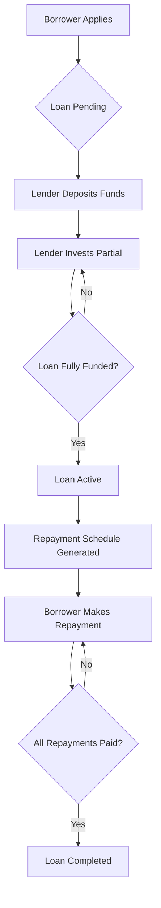

# MoneyCircle – Loan & Investment Workflow Documentation

This document outlines the complete **loan lifecycle** and **investment workflow** for the MoneyCircle platform. It covers all the key processes, business rules, and API interactions.

---

## 📋 Table of Contents

1. [Loan Workflow](#loan-workflow)
2. [Investment Workflow](#investment-workflow)
3. [API Endpoints Summary](#api-endpoints-summary)
4. [Business Rules](#business-rules)
5. [Testing Examples](#testing-examples)

---

## 🏦 Loan Workflow

### Overview

The loan workflow covers the complete lifecycle of a loan from application to completion or default.

```
[Borrower Applies] → [Pending] → [Funding] → [Active] → [Repayments] → [Completed/Defaulted]
```

---

### 1. Loan Application (Borrower)

**Endpoint:** `POST /api/loans`

**Request Body:**
```json
{
  "amount": 80000,
  "termMonths": 24,
  "purpose": "Debt consolidation",
  "loanType": "personal",
  "collateral": [] // optional
}
```

**Validation Rules:**

| Field | Rules |
|-------|-------|
| `amount` | R5,000 – R500,000 |
| `termMonths` | 3 – 84 months |
| `purpose` | 3–200 characters |
| `loanType` | `personal`, `secured`, `business`, `student` |

**Eligibility Checks:**

1. **DTI ≤ 40%** – Debt-to-income ratio must be ≤ 40%.
2. **No active defaulted loan** – Borrower cannot have a defaulted loan.
3. **Minimum income R6,500** – Monthly income must be ≥ R6,500.
4. **Max 1 active loan** – Borrower can only have one active loan at a time.

**Interest Rate Determination:**

Interest rate is based on the borrower's credit grade:

| Credit Grade | Interest Rate |
|--------------|---------------|
| A+ | 9% |
| A | 11% |
| B | 14.5% |
| C | 19% |
| D | 25% |
| E | 35% |

**Response:**
```json
{
  "success": true,
  "data": {
    "_id": "6a362937c62361fe6515e4bb",
    "status": "pending",
    "amount": 80000,
    "interestRate": 19,
    "termMonths": 24,
    // ... other fields
  }
}
```

---

### 2. Loan Funding (Lender)

**Endpoint:** `POST /api/loans/:id/fund`

**Request Body:**
```json
{
  "amount": 30000  // Amount the lender wants to invest
}
```

**Funding Process:**

1. **Check loan availability** – Loan must be `pending` and not fully funded.
2. **Check lender balance** – Lender must have sufficient `availableBalance`.
3. **Apply 75% rule** – Lender can invest max 75% of their available balance.
4. **Create investment record** – Track the lender's investment.
5. **Update loan funded amount** – Increment `fundedAmount`.
6. **If fully funded** → Loan becomes `active`, repayments are generated.

**Response:**
```json
{
  "success": true,
  "data": {
    "investment": { /* investment details */ },
    "loan": { /* updated loan */ },
    "remainingAmount": 50000
  }
}
```

---

### 3. Repayment Schedule

When a loan becomes `active`, an **amortisation schedule** is generated.

**Endpoint:** `GET /api/loans/:id/repayments`

**Response:**
```json
{
  "success": true,
  "data": [
    {
      "dueDate": "2026-08-20T05:46:32.728Z",
      "dueAmount": 4032.69,
      "interestPortion": 1266.67,
      "principalPortion": 2766.02,
      "remainingBalance": 77233.98,
      "status": "pending"
    },
    // ... 23 more repayments
  ]
}
```

**Repayment Calculation Formula:**

```
Monthly Payment = P × (r × (1+r)^n) / ((1+r)^n - 1)
```

Where:
- `P` = Principal amount
- `r` = Monthly interest rate (annual rate / 12)
- `n` = Number of months

---

### 4. Making a Repayment (Borrower)

**Endpoint:** `POST /api/loans/:id/repay`

**Request Body:**
```json
{
  "amount": 4032.69  // Must be exactly the due amount
}
```

**Process:**

1. Find the earliest pending repayment.
2. Verify the payment amount matches `dueAmount`.
3. Mark repayment as `paid`.
4. If all repayments are paid → Loan status becomes `completed`.

**Response:**
```json
{
  "success": true,
  "data": {
    "_id": "6a362939c62361fe6515e4c5",
    "status": "paid",
    "paidDate": "2026-06-20T05:46:32.728Z"
  }
}
```

---

### 5. Early Settlement

**Endpoint:** `GET /api/loans/:id/settlement`

**Response:**
```json
{
  "success": true,
  "data": {
    "settlementAmount": 82881.73,
    "fee": 820.61,
    "remainingPrincipal": 82061.12
  }
}
```

**Settlement Calculation:**

- **Fee:** 1% of remaining principal
- **Settlement Amount:** Remaining principal + 1% fee

---

### 6. Loan Statuses

| Status | Description |
|--------|-------------|
| `pending` | Loan waiting for funding |
| `active` | Loan funded, repayments active |
| `completed` | All repayments paid |
| `defaulted` | Loan defaulted (after missed repayments) |
| `rejected` | Loan rejected (admin or expired) |

---

## 📊 Investment Workflow

### Overview

The investment system allows **multiple lenders** to fund portions of a loan.

```
[Lender Deposits] → [Balance Updated] → [Invests in Loan] → [Loan Funded] → [Track Investments]
```

---

### 1. Lender Deposit (Wallet)

**Endpoint:** `POST /api/balance/deposit`

**Request Body:**
```json
{
  "amount": 50000
}
```

**Process:**

1. Find or create a `LenderBalance` record.
2. Add the deposit amount to `availableBalance`.
3. Log the transaction.

**Response:**
```json
{
  "success": true,
  "data": {
    "availableBalance": 50000,
    "investedAmount": 0,
    "totalReturns": 0
  }
}
```

---

### 2. Partial Loan Funding (Investment)

**Endpoint:** `POST /api/loans/:id/fund`

**Request Body:**
```json
{
  "amount": 30000
}
```

**Investment Process:**

1. **Validate:** Loan must be `pending` and not fully funded.
2. **Check balance:** Lender must have sufficient `availableBalance`.
3. **Apply 75% rule:** Lender can invest ≤ 75% of their available balance.
4. **Create Investment:** Record the lender's investment.
5. **Update Loan:**
   - `fundedAmount` += investment amount
   - `remainingAmount` = amount - fundedAmount
6. **If fully funded:**
   - Loan status → `active`
   - Repayment schedule generated
   - All investments → `active`

**Multiple Lenders Example:**

| Lender | Investment | Total Funded | Remaining |
|--------|------------|--------------|-----------|
| Pieter | R30,000 | R30,000 | R50,000 |
| Zanele | R50,000 | R80,000 | R0 |

---

### 3. View Investors

**Endpoint:** `GET /api/loans/:id/investors`

**Response:**
```json
{
  "success": true,
  "data": {
    "investors": [
      {
        "_id": "6a362937...",
        "lenderId": {
          "firstName": "Pieter",
          "lastName": "van der Merwe",
          "email": "pieter@investments.co.za"
        },
        "amount": 30000,
        "interestRate": 19,
        "status": "active",
        "fundedAt": "2026-06-20T05:46:32.728Z"
      },
      {
        "_id": "6a362938...",
        "lenderId": {
          "firstName": "Zanele",
          "lastName": "Khumalo",
          "email": "zanele.khumalo@fund.co.za"
        },
        "amount": 50000,
        "interestRate": 19,
        "status": "active",
        "fundedAt": "2026-06-20T05:47:32.728Z"
      }
    ],
    "total": 2,
    "fundedAmount": 80000,
    "remainingAmount": 0
  }
}
```

---

### 4. Lender Investments

**Endpoint:** `GET /api/lender/investments`

**Response:**
```json
{
  "success": true,
  "data": {
    "investments": [
      {
        "loanId": {
          "amount": 80000,
          "interestRate": 19,
          "termMonths": 24,
          "status": "active",
          "purpose": "Debt consolidation"
        },
        "amount": 30000,
        "status": "active",
        "fundedAt": "2026-06-20T05:46:32.728Z"
      }
    ],
    "total": 1
  }
}
```

---

### 5. Lender Dashboard

**Endpoint:** `GET /api/lender/dashboard`

**Response:**
```json
{
  "success": true,
  "data": {
    "balance": {
      "availableBalance": 20000,
      "investedAmount": 30000,
      "totalReturns": 0
    },
    "investments": {
      "total": 1,
      "active": 1,
      "completed": 0,
      "defaulted": 0
    },
    "recentInvestments": [
      {
        "loanId": { /* ... */ },
        "amount": 30000,
        "status": "active"
      }
    ]
  }
}
```

---

### 6. Auto-Invest

**Endpoint:** `POST /api/lender/auto-invest`

**Request Body:**
```json
{
  "maxAmount": 100000,
  "minTerm": 12,
  "maxTerm": 36,
  "maxInterestRate": 20,
  "creditGrade": "B",
  "maxInvestmentPerLoan": 20000
}
```

**Process:**

1. Find loans matching the criteria.
2. Automatically invest in each loan up to `maxInvestmentPerLoan`.
3. Stop when `maxAmount` is reached or no more loans match.

**Response:**
```json
{
  "success": true,
  "data": {
    "invested": 50000,
    "loansFunded": ["loanId1", "loanId2"]
  }
}
```

---

## 🔗 API Endpoints Summary

### Loan Endpoints

| Method | Endpoint | Description | Auth |
|--------|----------|-------------|------|
| POST | `/api/loans` | Apply for a loan | Borrower |
| GET | `/api/loans/my` | Get borrower's loans | Borrower |
| GET | `/api/loans/available` | Get loans available for funding | Lender |
| GET | `/api/loans/:id` | Get loan details | Auth |
| PUT | `/api/loans/:id/status` | Update loan status | Admin |
| POST | `/api/loans/:id/fund` | Fund a loan | Lender |
| GET | `/api/loans/:id/repayments` | Get repayment schedule | Auth |
| POST | `/api/loans/:id/repay` | Make a repayment | Borrower |
| GET | `/api/loans/:id/settlement` | Early settlement amount | Borrower |

### Investment Endpoints

| Method | Endpoint | Description | Auth |
|--------|----------|-------------|------|
| GET | `/api/balance` | Get lender balance | Lender |
| POST | `/api/balance/deposit` | Deposit funds | Lender |
| GET | `/api/lender/investments` | Get lender's investments | Lender |
| GET | `/api/lender/dashboard` | Lender dashboard | Lender |
| POST | `/api/lender/auto-invest` | Auto-invest | Lender |
| GET | `/api/loans/:id/investors` | Get investors for a loan | Lender |

---

## 📋 Business Rules

### Loan Rules

| Rule | Description |
|------|-------------|
| **Minimum amount** | R5,000 |
| **Maximum amount** | R500,000 |
| **Minimum term** | 3 months |
| **Maximum term** | 84 months |
| **DTI limit** | ≤ 40% |
| **Minimum income** | R6,500 |
| **Max active loans** | 1 per borrower |
| **Default check** | Borrower cannot have defaulted loans |
| **Loan expiry** | 7 days to fund, then expires |

### Investment Rules

| Rule | Description |
|------|-------------|
| **Minimum investment** | R1,000 |
| **Max per lender** | 75% of available balance |
| **Multiple lenders** | Unlimited |
| **Auto-invest** | Up to R10,000 per loan (configurable) |
| **Funding window** | 7 days to fully fund |

---

## 🧪 Testing Examples

### Full Test Flow

```powershell
# 1. Register users (borrower + lenders)
# 2. Login and get tokens
# 3. Deposit funds for lenders
# 4. Borrower applies for a loan
# 5. Lender 1 invests partial amount
# 6. Lender 2 invests remaining amount
# 7. Loan becomes active
# 8. View investors
# 9. View lender investments
# 10. View repayment schedule
# 11. Make a repayment
```

### Example Test Users

| Name | Role | Income | Phone | ID |
|------|------|--------|-------|-----|
| Lindiwe Mthembu | Borrower | R24,500 | +27821234568 | 9501015001080 |
| Pieter van der Merwe | Lender | R95,000 | +27829876544 | 8501015001081 |
| Zanele Khumalo | Lender | R78,000 | +27827778889 | 8701015001082 |

---

## 🔄 Workflow Diagram



---

## ✅ Summary

| Workflow | Key Actions | Status |
|----------|-------------|--------|
| **Loan** | Apply → Fund → Repay → Complete | ✅ Complete |
| **Investment** | Deposit → Invest → Track | ✅ Complete |
| **Repayment** | Schedule → Pay → Complete | ✅ Complete |
| **Auto-Invest** | Configure → Auto-execute | ✅ Complete |

---

